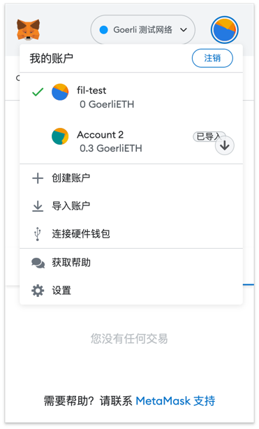
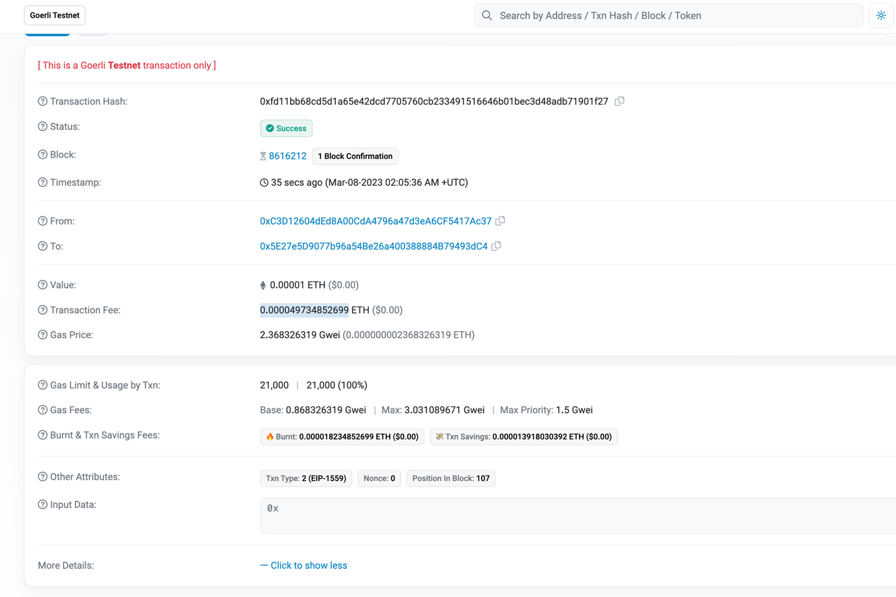
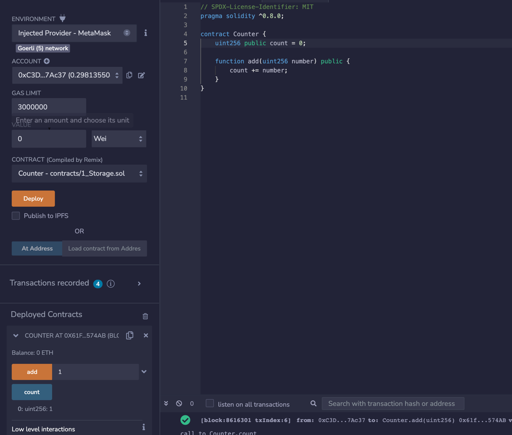

### 一、安装Metamask、并创建好账号
account: 0xC3D12604dEd8A00CdA4796a47d3eA6CF5417Ac37


 

### 二、执行一次转账

transaction Hash: 0xfd11bb68cd5d1a65e42dcd7705760cb233491516646b01bec3d48adb71901f27

from: 0xc3d12604ded8a00cda4796a47d3ea6cf5417ac37

to: 0x5e27e5d9077b96a54be26a400388884b79493dc4

value: 0.00001 ETH



### 三、使用Remix创建一个Counter合约并部署（包含add方法）

```
deploy Hash: 0xa3298175e0e157b69923de6de72a109e7e58b6b5e2016b7fe8bfa8a96f21efd5

contract: 0x61f823A767d816DB96e6F420CA429C7b287574AB

add transaction Hash: 0x461c3afd58bd5999f1da5507d302e79f69219be8b563f7ff5d1cc27e1ca8980c

byte code: 60806040526000805534801561001457600080fd5b506101c1806100246000396000f3fe608060405234801561001057600080fd5b50600436106100365760003560e01c806306661abd1461003b5780631003e2d214610059575b600080fd5b610043610075565b60405161005091906100af565b60405180910390f35b610073600480360381019061006e91906100fb565b61007b565b005b60005481565b8060008082825461008c9190610157565b9250508190555050565b6000819050919050565b6100a981610096565b82525050565b60006020820190506100c460008301846100a0565b92915050565b600080fd5b6100d881610096565b81146100e357600080fd5b50565b6000813590506100f5816100cf565b92915050565b600060208284031215610111576101106100ca565b5b600061011f848285016100e6565b91505092915050565b7f4e487b7100000000000000000000000000000000000000000000000000000000600052601160045260246000fd5b600061016282610096565b915061016d83610096565b925082820190508082111561018557610184610128565b5b9291505056fea2646970667358221220eb51c1f4449b36241dee7043b1b2e0638b3ff081fa7182c8f088920b08d869b764736f6c63430008110033

ABI: [
	{
		"inputs": [
			{
				"internalType": "uint256",
				"name": "number",
				"type": "uint256"
			}
		],
		"name": "add",
		"outputs": [],
		"stateMutability": "nonpayable",
		"type": "function"
	},
	{
		"inputs": [],
		"name": "count",
		"outputs": [
			{
				"internalType": "uint256",
				"name": "",
				"type": "uint256"
			}
		],
		"stateMutability": "view",
		"type": "function"
	}
]
```



